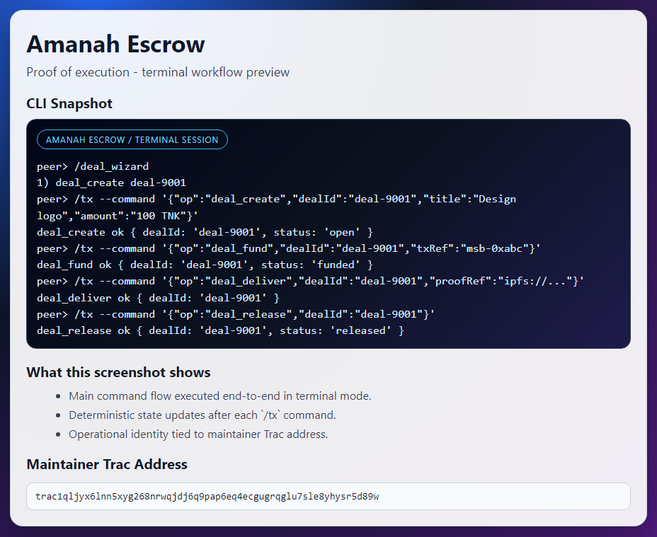

# Amanah Escrow

Amanah Escrow is designed for two-party work agreements where funds are secured first, deliverables are verified, and then released or refunded.

## Maintainer Address
`trac1qljyx6lnn5xyg268nrwqjdj6q9pap6eq4ecgugrqglu7sle8yhysr5d89w`

## Product Proof


## Escrow Workflow (Practical)
### Phase 1 - Opening
- `deal_create`: create the deal and terms.
- `deal_fund`: attach funding reference.

### Phase 2 - Delivery
- `deal_deliver`: submit final result/proof.
- `deal_dispute`: open a dispute when outcomes diverge.

### Phase 3 - Closing
- `deal_release`: release funds to the receiver.
- `deal_refund`: return funds to the payer.
- `deal_resolve`: finalize dispute decision.
- `deal_cancel`: cancel a deal before completion.

## Runtime
```bash
pear run . --peer-store-name admin --msb-store-name admin-msb --subnet-channel amanah-escrow-v1
```

## Terminal Tooling
```text
/deal_examples
/deal_wizard
```

## Changelog
## v0.1.0 - 2026-02-20
- Added centralized parse helpers for boolean flags, CSV values, key-value lists, and JSON/base64 payloads.
- Added optional parsing support for `@file` input, object passthrough, and configurable base64 prefix handling.
- Reduced duplicated parsing logic by reusing shared helpers across runtime config parsing, protocol invite/welcome parsing, and SC-Bridge payload parsing.
- Added unit tests for parser behavior and edge cases (valid JSON/base64, file-based input, and invalid input handling).

## References
- Fork source: https://github.com/Trac-Systems/intercom
- Awesome list target: https://github.com/Trac-Systems/awesome-intercom
